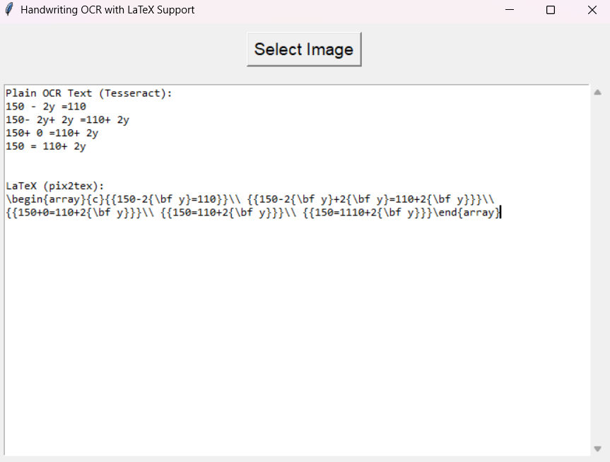

# Minimal LaTeX OCR

This project provides a simple tool to extract both plain text and LaTeX equations from handwritten or printed images using OCR. It features a user-friendly GUI for selecting images and viewing results.

## Features
- Extracts regular text using Tesseract OCR
- Extracts LaTeX code for math equations using [pix2tex (LaTeX-OCR)](https://github.com/lukas-blecher/LaTeX-OCR)
- Simple graphical interface (GUI) for easy use
- Results are displayed in the app and saved to `output.txt`

## Requirements
- Python 3.7+
- Tesseract OCR (install from https://github.com/tesseract-ocr/tesseract)
- pip packages: `pytesseract`, `Pillow`, `pix2tex[gui]`, `tkinter`

## Installation
1. **Install Tesseract OCR**
   - Download and install from: https://github.com/tesseract-ocr/tesseract
   - Add Tesseract to your system PATH or edit the script to set the path explicitly.

2. **Install Python dependencies**
   ```bash
   pip install pytesseract Pillow "pix2tex[gui]"
   ```

## Usage
1. Run the script:
   ```bash
   python ocr_handwriting.py
   ```
2. In the GUI, click "Select Image" and choose your image file.
3. The extracted text and LaTeX will be shown in the window and saved to `output.txt` in the same folder as your image.

## Example


## Credits
- [pix2tex (LaTeX-OCR)](https://github.com/lukas-blecher/LaTeX-OCR)
- [Tesseract OCR](https://github.com/tesseract-ocr/tesseract)

---

MIT License 